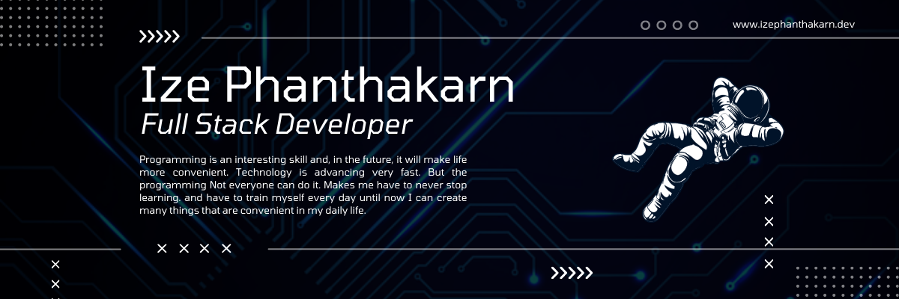

# 👋🏻 Hi, I'm Phanthakarn Khumphai 🦈✨

I am a developer with a passion for creating websites, web applications and applications to improve my skills. Some of the technologies that I like to use are  NuxtJS,  VueJS ,  Golang API,  PostgreSQL and  Google Cloud Platform.

I am currently studying at Silpakorn University and accepting a part-time job building websites.And I have created a website <a href="https://www.izephanthakarn.dev">Phanthakarn's Portfolio</a> for my portfolio, showcase my profile, my skills, projects, personal information and my contact.

3+ years of experience as a software developer. Fast learner and eager to explore new technologies. Love developing beautiful and useful websites. Teamwork and Clean Code always question the status quo and want to improve.

In the future, I have a plan to develop myself such as creating mobile applications, blockchain development, writing bots to reduce redundant work. And developing their own applications for convenience in everyday life, such as recording income and expenses Health tracking and private social media to use with close ones.

> Technology advances every day. So I must never stop learning.

  
  
  

  
  
  
  

 

##  About me

- 🌱 I am a `Junior` at [Faculty of Electrical Engineering](https://ee-eng.su.ac.th/) at [Silpakorn University](https://www.su.ac.th/).
- 🔭 I’m currently working on `my mini projects`
- 💬 Ask me about `Front-end`
- :computer: I love using Software as a solution for every `Problem`.
- :mortar_board: I’m  always `learning new things`.
- :orange_book: Know about my experiences at [MY RESUME](http://lnkiy.in/Ahmed_Hossam_Resume).
- :boom: 👨‍💻 All of my projects are available at [MY WEBSITE](https://www.izephanthakarn.dev).
- ⚡ Fun fact: I never thought I would become a web developer!

  

## 🛠️ My Skills
### 👨‍💻 Programming Languages

    
    
    
    
    
    
    

### 🗄️ Databases and Cloud Hosting

    
    
    
    
    

### 💻 Tools

    
    
    
    
    

### 👨🏽‍💻 Others

###  Connect with me

### ⚙️ Github Stats

